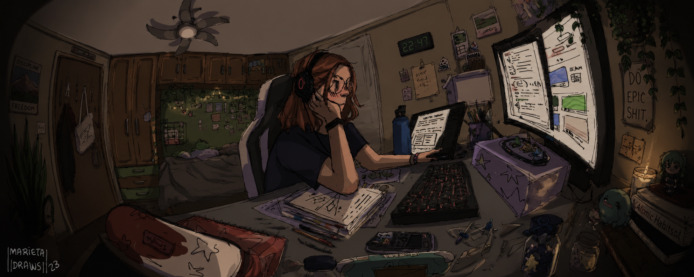

<h1 align="center" style="font-size: 144px; font-weight: 700; margin-bottom: 10px;">
  Hi, I'm Ifrah.
</h1>

  

 

<!-- SOCIAL BADGES -->

&nbsp;&nbsp;

&nbsp;&nbsp;

&nbsp;&nbsp;

  

<!-- ABOUT -->

<h2 style="font-family: 'Space Grotesk', sans-serif; color:#17045c;">
About
</h2>

Engineering student building systems-focused products with an interest in backend systems,
graph algorithms, product engineering and visual design.

Currently building:
• AlgoNest — mentorship-driven learning platform  
• Travel Metro — graph-based metro routing engine  
• EngLive — 1:1 English mentorship platform

 

<!-- TECH STACK -->

<h2 style="font-family: 'Space Grotesk', sans-serif; color:#17045c;">
Tech Stack
</h2>

 

<!-- CURRENTLY EXPLORING -->

<h2 style="font-family: 'Space Grotesk', sans-serif; color:#17045c;">
Currently Exploring
</h2>

• Scalable backend systems  
• Graph algorithms and traversal systems  
• Product architecture  
• Developer tooling and platform design

 

<!-- FEATURED PROJECTS -->

<h2 style="font-family: 'Space Grotesk', sans-serif; color:#17045c;">
Featured Projects
</h2>

<table>
<tr>

<td width="50%">

<h3>🚇 Travel Metro</h3>

Graph-based metro routing engine using Bellman Ford algorithm and Haversine formula.

Tech:
Java • Spring Boot • Leaflet.js

</td>

<td width="50%">

<h3>🧠 AlgoNest</h3>

Mentorship-driven learning platform focused on project-based education.

Tech:
Node.js • Supabase

</td>

</tr>
</table>

 

<!-- FOOTER -->

Building systems, products and ideas.

